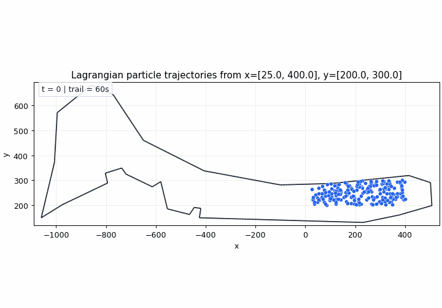

# Lagrangian Particle Simulation

Simulates passive Lagrangian particles directly from VTU velocity files:



```text
VTU velocity -> RK2 advection + random walk -> CSV trajectories
```

The script loads the VTU mesh, seeds particles randomly inside `x=[25, 500]` and `y=[200, 300]` by default, interpolates velocity over the unstructured mesh, and removes particles once they leave the mesh.

## Inputs And Map Names

The VTU input glob is required:

```text
--vtu-glob "velocity_fields/<map_name>/raw/Velocity2d/*.vtu"
```

The simulator infers the map name from the VTU path. For example, `velocity_fields/sydney_regatta/raw/Velocity2d/*.vtu` infers `sydney_regatta`.

Default outputs are grouped by map name:

```text
backend/lagrangian_sim/outputs/sydney_regatta/sydney_regatta_lagrangian_particle_trajectories.csv
backend/lagrangian_sim/outputs/sydney_regatta/sydney_regatta_lagrangian_particle_trajectories.gif  # with --gif
```

Use `--map-name` to override the inferred name.

## Usage

Run from a config file:

```bash
python3 backend/lagrangian_sim/simulate_lagrangian_particles.py \
  --config backend/lagrangian_sim/config.example.json
```

Command-line options override config values:

```bash
python3 backend/lagrangian_sim/simulate_lagrangian_particles.py \
  --config backend/lagrangian_sim/config.example.json \
  --particles 200 \
  --gif-fps 3
```

Basic CSV run:

```bash
python3 backend/lagrangian_sim/simulate_lagrangian_particles.py \
  --vtu-glob "velocity_fields/sydney_regatta/raw/Velocity2d/*.vtu" \
  --particles 200 \
  --steps 600 \
  --dt 1.0 \
  --field-dt 1.0 \
  --diffusivity 0.05
```

Run with timed particle releases and a GIF:

```bash
python3 backend/lagrangian_sim/simulate_lagrangian_particles.py \
  --vtu-glob "velocity_fields/sydney_regatta/raw/Velocity2d/*.vtu" \
  --particles 100 \
  --steps 300 \
  --dt 1.0 \
  --field-dt 1.0 \
  --diffusivity 0.05 \
  --release-interval 10 \
  --release-particles 25 \
  --gif \
  --gif-max-frames 40
```

Run on another map:

```bash
python3 backend/lagrangian_sim/simulate_lagrangian_particles.py \
  --vtu-glob "velocity_fields/my_map/raw/Velocity2d/*.vtu" \
  --map-name my_map \
  --particles 100 \
  --steps 300 \
  --gif
```

Run with a custom output GIF path:

```bash
python3 backend/lagrangian_sim/simulate_lagrangian_particles.py \
  --vtu-glob "velocity_fields/sydney_regatta/raw/Velocity2d/*.vtu" \
  --particles 100 \
  --steps 300 \
  --diffusivity 0.05 \
  --gif \
  --output-gif backend/lagrangian_sim/outputs/sydney_regatta/my_particle_run.gif
```

## Seeding Options

- `--particles`: number of particles in the initial release.
- `--seed-x-min`, `--seed-x-max`, `--seed-y-min`, `--seed-y-max`: random rectangle seed bounds. Defaults to `x=[25, 500]`, `y=[200, 300]`.
- `--seed-fixed`: seed all particles at `--start-x`/`--start-y` instead of the random rectangle.
- `--start-x`, `--start-y`: fixed initial particle coordinate used with `--seed-fixed`.
- `--seed-upstream`: seed along the inferred upstream edge instead of the random rectangle.
- `--upstream-band-width`: mesh-unit width of the upstream seeding band. The default is 2% of the mesh diagonal.
- `--seed-jitter`: optional Gaussian jitter for initial particle positions.

## Time And Motion Options

- `--steps`: maximum number of advection steps.
- `--dt`: particle integration timestep.
- `--field-dt`: time spacing between VTU files.
- `--diffusivity`: random-walk diffusivity `D`; random displacement has standard deviation `sqrt(2 D dt)`.
- `--release-interval`: add a new particle batch every N simulation seconds. For example, `10` releases new particles every 10 seconds.
- `--release-particles`: number of particles per timed release. Defaults to `--particles`.

## Output Options

- `--config`: JSON config file. Command-line options override config values. See `config.example.json`.
- `--map-name`: map name used for default output folder and filenames. It is inferred from the VTU path when omitted.
- `--output-csv`: trajectory CSV path. Defaults to `backend/lagrangian_sim/outputs/<map_name>/<map_name>_lagrangian_particle_trajectories.csv`.
- `--output-stride`: write trajectory rows every N simulation steps. Releases are always written. Use this to reduce CSV size and speed up long runs.
- `--gif`: write an animated GIF with the mesh border and particle paths.
- `--output-gif`: choose the GIF output path. Defaults to `backend/lagrangian_sim/outputs/<map_name>/<map_name>_lagrangian_particle_trajectories.gif`.
- `--gif-fps`: choose the animation frame rate.
- `--gif-max-frames`: cap the number of rendered GIF frames. Defaults to `80`; use `0` to render every simulation step.
- `--gif-stride`: render every Nth simulation step. Values greater than `1` override `--gif-max-frames`.
- `--gif-trail-duration`: seconds of trajectory history to show before traces disappear. Defaults to `60`; use `0` to keep full trails.
- `--gif-dpi`: choose GIF render resolution. Defaults to `90`.
- `--gif-show-mesh`: draw interior mesh triangle lines. By default only map borders are drawn.
- `--gif-mesh-edges`: cap the number of mesh triangles drawn when `--gif-show-mesh` is used. Defaults to `1500`; use `0` to draw all triangles.
- `--gif-mesh-color`, `--gif-mesh-linewidth`, `--gif-mesh-alpha`: style the mesh lines in the GIF.
- `--gif-border-color`, `--gif-border-linewidth`, `--gif-border-alpha`: style the map border lines in the GIF.

## CSV Columns

```text
particle_id, generation, step, time, x, y, u, v, status, vtu_frame, vtu_file
```

- `particle_id`: unique particle identifier.
- `generation`: release batch; `0` is the initial release, `1` is the first timed release, and so on.
- `status`: `active`, `exited`, or `released`.
